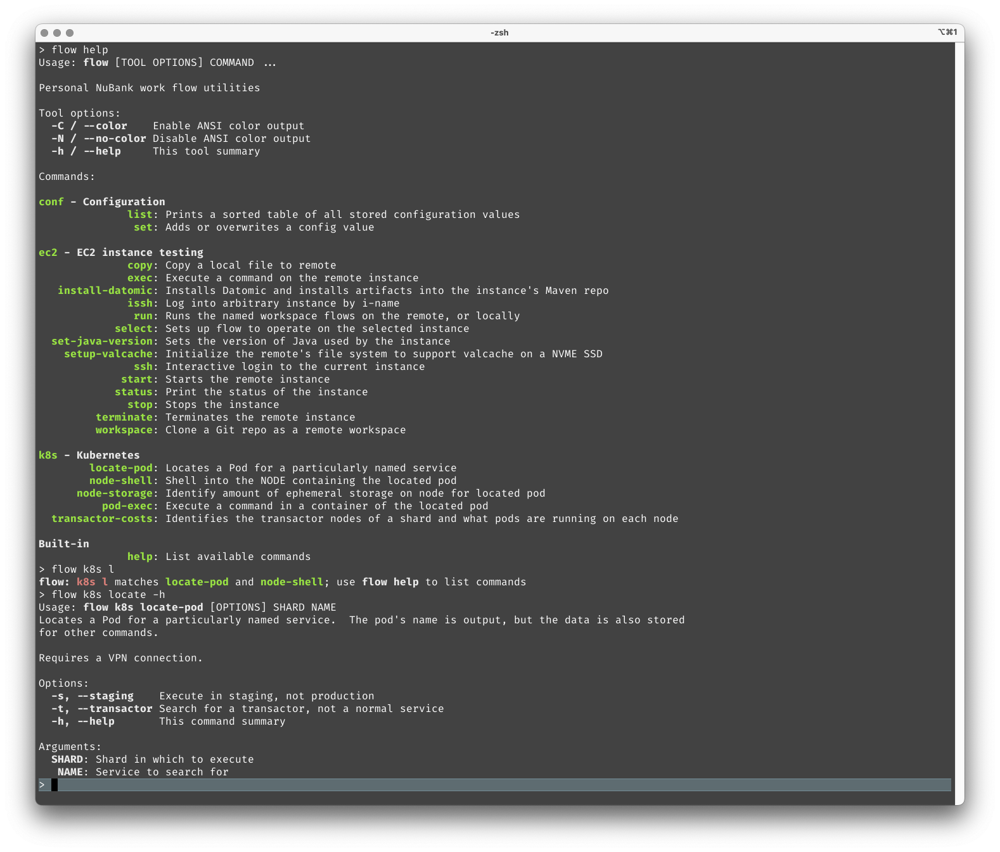
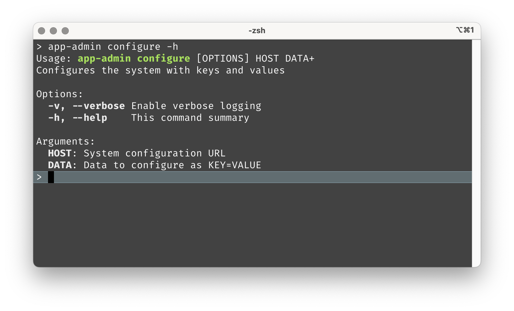
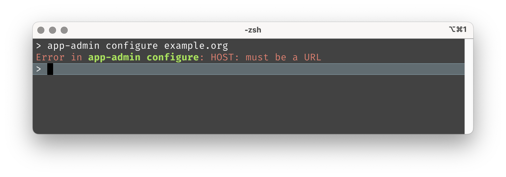
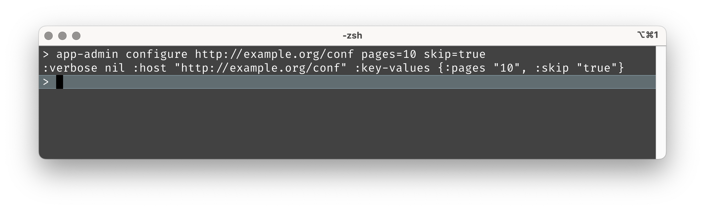
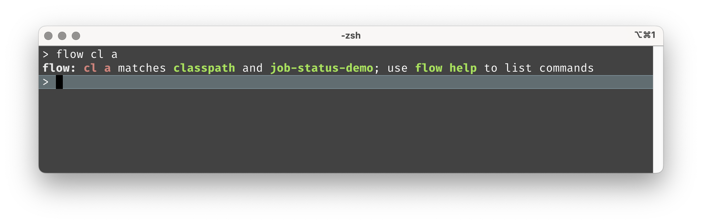

# io.github.hlship/cli-tools

[](https://clojars.org/io.github.hlship/cli-tools)
<a href="https://babashka.org" rel="nofollow"></a>
[](https://cljdoc.org/d/io.github.hlship/cli-tools)

`cli-tools` is a complement to [Babashka](https://github.com/babashka/babashka) used to create tools
with sub-commands, much like [Babashka tasks](https://book.babashka.org/#tasks). It is effectively
a layer on top of [org.clojure/tools.cli](https://github.com/clojure/tools.cli).

`cli-tools` is more verbose than [babashka-cli](https://github.com/babashka/cli) and more opinionated.
At the core, you define local symbols and instructions for how those symbols map to command line options
or positional arguments; `cli-tools` takes care of the majority of command line parsing and validation
for you.

`cli-tools` is intended to create three types of command lines tools:
 
- A simple tool simply parses its command line arguments and executes some code using those arguments (think: `ls` or `cat`)
- A common tool is composed of multiple commands, across multiple namespaces. The first command line argument
  will select the specific sub-command to execute. (think: `git`)
- A complex tool organizes some commands into command groups that share an initial name (think `kubectl`)


For tools with multiple commands, `cli-tools` automatically adds 
a built-in `help` command to list out what commands are available, and
can even perform basic searches for commands.

For complex tools, what `cli-tools` offers is **discoverability**.  You define the switches, options, and arguments for each command, and each command gets a `--help` switch to print
out the command's summary. The  `help` command
that can list out all the commands available, neatly organized, and can even do a simple
search for you.  There's even (experimental) support for zsh completions for your tool and all of its categories, commands, and options.

This kind of discoverability is a big improvement over shell aliases, and one-off shell scripts that leave you guessing what they do and what arguments need to be passed in.

`cli-tools` also offers great **feedback**, using indentation, color, and careful attention
to detail, to provide tool users with consistent, readable, and friendly error messages, command summaries, and so forth.

`cli-tools` can work with Babashka, or with Clojure, but the near instantaneous startup time of Babashka is compelling
for the kind of low-ceremony tools that `cli-tools` is intended for.

Although `cli-tools` can be used to build shared tools, it is also fully intended for developers to create a personal
toolkit of commands specific to their individual workflows, as an alternative to a collection of shell aliases and one-off shell scripts.

Below is an example of the author's personal toolkit, `flow`:



A complete and open-source example is [dialog-tool](https://github.com/hlship/dialog-tool), which also shows how to organize 
a tool so that it can be installed as a Homebrew formula.

## defcommand

The core utility is the `net.lewisship.cli-tools/defcommand` macro, which defines a command in
terms of a command-line interface, and a body that acts on the data collected from the command line.

The interface defines options as well as positional arguments; those options and arguments are available
in the body of the command just as if they were parameters passed to the command.
`defcommand` defines a function that accepts a variadic number of command line argument strings, 
parses them as options and positional arguments, binds those to local symbols, and evaluates the body.

An example to begin; let's say you are creating a command for administrating some part of your application.
You need to know a URL to update, and a set of key/value pairs to configure.  Let's throw in a `--verbose`
option just for kicks.

**src/app_admin/commands.clj**:

```clojure
(ns app-admin.commands
  "Commands specific to this project"
  (:require [net.lewisship.cli-tools :refer [defcommand]]))

(defcommand configure
  "Configures the system with keys and values"
  [verbose ["-v" "--verbose" "Enable verbose logging"]
   :args
   host ["HOST" "System configuration URL"
         :validate [#(re-matches #"https?://.+" %) "must be a URL"]]
   key-values ["DATA" "Data to configure as KEY=VALUE"
               :parse-fn (fn [s]
                           (when-let [[_ k v] (re-matches #"(.+)=(.+)" s)]
                             [(keyword k) v]))
               :update-fn (fn [m [k v]]
                            (assoc m k v))
               :repeatable true]]
  ; Placeholder:               
  (prn :verbose verbose :host host :key-values key-values))
```

The meat of this `configure` command has been replaced with a call to `prn`, but
the important part for this discussion is the interface, which takes the place of an ordinary
function's parameters declaration.

Initially, the interface is about options, and we define one option, `--verbose`, a flag.
Inside the body, the value will be bound to local symbol `verbose`, which will be nil if `--verbose` is
not specified, or true if it is.

`defcommand` always adds the `-h` / `--help` flag, and implements it; the body does not get
evaluated if help is requested, or if there's any kind of validation error processing 
command line arguments.

An option definition always starts with three strings: the short option name, the long option name,
and the option description; these are positional, and a nil may be supplied.

A namespace with commands is only part of the solution, to get from a terminal command line
to the body of the `configure` function, we need to add Babashka script, `bin/app-admin`, which 
invokes the `cli/dispatch` function.


**bin/app-admin**:

```shell
#!/usr/bin/env bb

(require '[net.lewisship.cli-tools :as cli])

(cli/dispatch {:namespaces '[app-admin.commands]})
```

The first line identifies, to the shell, that this command is implemented using Babashka.

`dispatch` will find all `defcommand`s in the given namespaces, parse the first command line argument, and use
it to find the correct command to delegate to.  That command will be passed the remaining command line arguments.
The default tool name will be the name of the script, `app-admin` in this example.

`dispatch` also recognizes `-h`, `--help`, or `help`, and will print out a summary of the available commands.

Finally, `dispatch` will allow an abbreviation of a command name to work, as long as that abbeviation uniquely
identifies a single possible command.

How does the `app-admin` script know where to find the code?  We add a `bb.edn` file to the `bin` directory.

**bin/bb.edn**

```clojure
{:paths ["../src" "../resources"]
 :deps {io.github.hlship/cli-tools {:mvn/version "<mvn version>"}}}      
```

Babashka looks for the `bb.edn` file in the same directory as the script, and uses it to set up the classpath.

The final step is to add that `bin` directory to the shell `$PATH` environment variable; this is done in your
`~/.zshrc` file, or equivalent.

Alternately, if you already have a location for commands, such as `~/bin`, you can create a symbolic link there
that points to your `bin/app-admin` script; Babashka will follow links and find the neighboring `bb.edn` file 
at the final location of the script.  Handy!

With all that in place, we can now run `app-admin configure` through its paces:



> You may see a short delay the first time your script is executed as dependencies are resolved and downloaded;
> Subsequent executions are lightning fast.


Help is provided automatically, and builds its content from the interface and the docstring
of each command function.  The docstring is required.

Validations are reported with the  tool name and command name:



The text above is written to standard error, and the command exit status is 1 (where 0 would mean success).

Unless there are errors, the body of the command is invoked:



The body here just prints out the values passed in.  That's not a bad starting point when creating new scripts.
I like to get all the command line parsing concerns out of the way before working on the _meat_ of the command.

## Abbreviated Commands

Feel free to give your commands long names; when `dispatch` is identifying a command to invoke
from the provided name on the command line, it will
find any commands whose name contains the provided name; so `app-admin conf` would work, as would `app-admin c` ... 
as long as there aren't multiple matches for the substring.

When there are multiple matches, `dispatch` will abort and the error message will identify which commands matched the provided string.

Exception: when the provided name _exactly_ matches a command's name, then that command will be used even if 
the provided name is also a prefix or substring of some other command name.



## Positional Arguments

The way positional arguments are defined is intended to be similar to how
options are defined in `clojure.tools.cli`:

```
["<LABEL>" "<DOC>" <key/value pairs>]
```

The `<LABEL>` is a string used in the summary, and in validation error messages;
the `<DOC>` is a string used in the summary.  After that come key/value pairs.

* `:optional` (boolean, default false) -- if true, the argument may be omitted if there isn't a
    command line argument to match

* `:repeatable` (boolean, default false) -- if true, then any remaining command line arguments are processed
by the argument

* `:parse-fn` - passed the command line argument string, returns a value, or throws an exception

* `:validate` - a vector of function/message pairs

* `:update-fn` - optional function used to update the (initially nil) entry for the argument in the arguments map
 
* `:assoc-fn` - optional function used to update the arguments map; passed the map, the argument id, and the parsed value

* `:update-fn` and `:assoc-fn` are mutually exclusive.

For repeatable arguments, the default update function will construct a vector of values.
For non-repeatable arguments, the default update function simply sets the value.

Only the final positional argument may be repeatable.

Also note that all command line arguments _must be_ consumed, either as options or as positional arguments.
Any additional command line arguments will be reported as a validation error.

## defcommand options

The interface vector of defcommand may have additional options; these are keywords that change
how following values in the vector are parsed. We saw this in the example above, where `:args` was used to 
switch from defining options to defining positional arguments.

### :options

Indicates that any following terms define options; this is the initial parser state, so `:options`
is rarely used.

### :args

Indicates that any following terms define positional arguments.

### :as \<symbol\>

Inside the interface, you can request the _command map_ using `:as`.
This map captures information about the command, command line arguments,
and any parsed information; it is used when invoking `net.lewisship.cli-tools/print-errors`, 
which a command may wish to do to present errors to the user.

### :command \<string\>

Overrides the default name for the command, which is normally the same as the function name.
This is useful, for example, when the desired command name would conflict with a clojure.core symbol,
or something else defined within your namespace.

The `:command` option is also useful when using cli-tools to define
the `-main` function for a simple tool (a tool with options and arguments,
but not subcommands).

### :summary \<string\>

Normally, the summary (which appears next to the command in the `help` tool summary) is just
the first sentence of the command's docstring, up to the first `.`.  If, for some reason,
that default is incorrect, the command's summary can be explicitly specified using `:summary`.

### :in-order true

By default, options are parsed using `clojure.tools.cli/parse-opts`, with the `:in-order` option set to false;
this means that `parse-opts` will stop at the first
option-like string that isn't declared.

```
(defcommand remote
  "Use ssh to run a command remotely."
  [verbose ["-v" "--verbose"]
   :args
   command ["COMMAND" "Remote command to execute"]
   remote-args ["ARGS" "Arguments to remote command"
                :optional true
                :repeatable true]]
     ...)
```

You might expect that `app-admin remote ls -lR` would work, but it will fail
with an error that `-lR is not recognized`.

You can always use `--` to split options from arguments, so `app-admin remote -- ls -lR` will work,
but is clumsy.

Instead, add `:in-order true` to the end of the interface, and any
unrecognized options will be parsed as positional arguments instead,
so `app-admin remote ls -lR` will work, and `-lR` will be provided as a string in the `remote-args`
seq.

### :let \<bindings\>

It can be useful to define local symbols that can be referenced inside the option
and arguments definitions; the `:let` keyword is followed by a vector of bindings.

```clojure
(defcommand set-mode
  "Sets the execution mode"
  [mode ["-m" "--mode MODE" (str "Execution mode, one of " mode-names)
         :parse-fn keyword
         :validate [allowed-modes (str "Must be one of " mode-names)]]
   :let [allowed-modes #{:batch :async :real-time}
         mode-names (->> allowed-modes (map name) sort (string/join ", "))]]
  ...)
```

> Note that the `new.lewisship.cli-tools/select-option` function is an easier way to create such
> an option.

In the expanded code, the bindings are moved to the top, before the option and argument
definitions.  Further, if there are multiple `:let` blocks, they are concatinated.

This also means that the bindings _can not_ reference the symbols for options or arguments.

### :validate \<vector of test/message pairs\>

Often you will need to perform validations that consider multiple fields.
The `:validate` directive adds tests that occur after primary parsing of command line options
has occurred, but before executing the body of the function.

It is a vector of tests and messages.
Each test expression is evaluated in turn; if the result is falsey, then the message
is passed to `print-errors` as an error, and `exit` is called with the value 1.

A common case is to handle mutually exclusive arguments:

```clojure
(defcommand sort-data
  "Sorts some data"
  [alpha ["-a" "--alpha-numeric" "Sort in alpha-numeric order"]
   numeric ["-n" "--numeric" "Sort in numeric order"]
   :validate [(not (and alpha numeric)) "Only one of --alpha-numeric or --numeric is allowed"]]
  ; At most one of alpha or numeric is true here
)
```

Note that unlike a validate function for an option or argument, these are expressions that can leverage 
local symbols (such as `alpha` and `numeric`) and not functions that are passed a value.

## Namespaces and categories

Each namespace that defines commands (as passed to the `dispatch` function) becomes a _category_,
containing the commands defined in that namespace.

This is used by the built-in `help` command, which prints a summary of the tool and all commands
in the tool:

```
> app-admin help
Usage: app-admin COMMAND ...

Application adminstration tools.

Commands:

System configuration
  configure: Configures the system with keys and values
       list: List configuation for the system

Built-in
       help: List available commands
```

The namespace `net.lewisship.cli-tools` is automatically added, and has the label "Built-in".
By default, a namespace's label is the same as it's namespace name, but this is usually
overridden by setting the :command-category metadata on the namespace to a short string.

Each category has a sort order, which defaults to 0.  The categories are sorted by this sort order,
then (within each set of categories with the same sort order) by label.  The sort order
can be specified as the :command-category-order metadata on the namespace.  `net.lewisship.cli-tools.builtins` has
a sort order of 100, so that it will generally be last.

If you want to see the list of commands without categories, use the `-f` / `--flat` option to `help`.
If you want to use multiple namespaces for your commands without using categories,
add `:flat true` to the options map passed to `dispatch`.

The `help` command itself accept a single search term; it will filter the commands and categories it outputs to only
those that contain the search term in either the command name, or command summary. This search is caseless.

## :command-ns meta-data

Normally, there is a 1:1 mapping from namespace to category. In rare cases, you may want to have multiple namespaces
map to the same category.

A namespace may have a :command-ns meta-data, whose value is a symbol identifying another namespace.  The commands
in the new namespace are categorized as if they were in the identified namespace.  Order counts: make sure the referenced
namespace is listed before the referencing namespace.

An example of this is the `net.lewisship.cli-tools.colors` namespace:

```clojure

(ns net.lewisship.cli-tools.colors
  {:command-ns 'net.lewisship.cli-tools.builtins}
  (:require [clj-commons.ansi :refer [pout]]
            [clojure.string :as string]
            [net.lewisship.cli-tools :refer [defcommand]]))

(def ^:private width 16)

(defcommand colors
...
```
This adds an additional command to the built-in category, `colors`, as if it were declared in the `builtins` namespace.

You can add this namespace to your own tools:


## Command Groups

A category can also have a `:command-group` metadata value, a short string that acts like a command name.
All commands in the same namespace/category are only accessible via that group command.  The built-in `help`
command will identify the command group when listing the commands in the category.

Command groups are useful when creating the largest tools with the most commands; it allows for shorter command names,
as each commands' name will only have to be unique within it's command group, not globally.

## Utilities

### abort

The `net.lewisship.cli-tools/abort` function provides a uniform way to indicate a failure
and terminate execution.

`abort` can be invoked from inside a command, and will output (to standard error)
the tool name and command name in bold red, and the provided messages
in red.

Messages may also be exceptions, from which the exception message is extracted (exceptions with a null message
are converted to the exception class name).

Finally, `abort` invokes `exit` with the provided exit status code.

## Testing

Normally, the function defined by `defcommand` is passed a number of string arguments, from
`*command-line-args*`; it then parses this into a command map, a map with an `:options` key
that contains all the parsed and validated values for options and positional arguments (plus a lot of undocumented internal data).

For testing purposes, you can bypass the parsing and validation, and just pass a single map to the function. 
The map must provide a keyword key for each option or positional argument; the keys match the option or argument symbols,
even for options that normally have a default value. All normal option or argument validation is skipped.

You may need to mock out `net.lewisship.cli-tools/print-errors` if your command
invokes it, as that relies on some internal state from undocumented dynamicall-bound vars. 

Fortunately, it is quite rare for a command to need to invoke this function.

When _not_ bypassing parsing and validation (that is, when testing by passing strings to the command function), 
validation errors normally print a command summary and then call `net.lewisship.cli-tools/exit`, which in turn, invokes `System/exit`; this is obviously 
problematic for tests, as the JVM will exit during test execution.

The function `net.lewisship.cli-tools/set-prevent-exit!` can convert those cases to instead
throw an exception, which can be caught by tests.

Further, application code should also invoke `net.lewisship.cli-tools/exit`
rather than `System/exit`, for the same reasons.

## Caching

In order to operate, `cli-tools/dispatch` has to load all namespaces, to execute the `defcommand` macros in each, 
and collect meta-data from all the namespaces and command functions.  Thanks to Babashka, this is extremely fast,
but is made faster using caching.

`dispatch` builds a cache based on the options passed to it, and the contents of the classpath; it can then 
load the data it needs to operate from the cache, if such data is present.

When executing from the cache, `dispatch` will ultimately load only a single command namespace,
to invoke the single command function.  This allows a complex tool, one with potentially hundreds of commands, to still execute the body
of the `defcommand` within milliseconds.

This may have an even more significant impact for a tool that is built on top of Clojure, rather than Babashka.
Our mockup of 1500 commands across 250 namespaces executes approximately 
twice as fast using the cache (approximately 8 seconds with the cache, vs. 17 seconds without).

Babashka is amazingly fast for these purposes; the same test executes in 0.23 seconds.

By default, `dispatch` will store its cache in the `~/.cli-tools-cache` directory; the environment variable
`CLI_TOOLS_CACHE_DIR` can override this default.

## Tips and Tricks

### Parsing Numbers

When an input is numeric, you can use Clojure's `parse-long` function to parse a number; it returns nil if
the string is not a number.  You can then check using `some?` within :validate:

```
(defcommand kill-port
  "Kills the listening process locking a port."
  [force ["-f" "--force" "Kill process without asking for confirmation"]
   :args
   port ["PORT" "Port number to kill"
         :parse-fn parse-long
         :validate [some? "Not a number"
                    pos? "Must be at least 1"]]]
  ...)                    
```

This handles invalid input gracefully:

```
> flow kill-port abc
Error in flow kill-port: PORT: Not a number
```

You might be tempted to use `#(Long/parseLong %)` as the parse function; this works, but the message produced comes from 
the message of the thrown exception, and is not very friendly:

```
> flow kill-port abc
Error in flow kill-port: PORT: Error in PORT: For input string: "abc"
```

## Job Board (experimental)

For tools that run for a while, visual feedback can be provided to the user using the _job board_
in the `net.lewisship.cli-tools.job-status` namespace.


Background processes (typically, running as individual threads, or core.async processes) 
can provide feedback on status and progress through a simple API. 
The job board updates status lines as they change, and highlights lines that have recently changed.

This is built on the `tput` command line tool, so it works on OS X and Linux, but **not on Windows**.

The above `job-status-demo`, like `colors`, can be added by including the `net.lewisship.cli-tools.job-status-demo` namespace.

## zsh completions (experimental)

The namespace `net.lewisship.cli-tools.completions` adds a `completions` command.  This command will
compose a zsh completion script, which can be installed to a directory on the $fpath such as
`/usr/local/share/zsh/site-functions`.


zsh completions greatly enhance the discoverability of commands, categories, and command options within a tool.
However, this functionality is considered _experimental_ due to the complexity of zsh completion scripts.


## License

`io.github.hlship/cli-tools` is (c) 2022-present Howard M. Lewis Ship.

It is released under the terms of the Apache Software License, 2.0.
