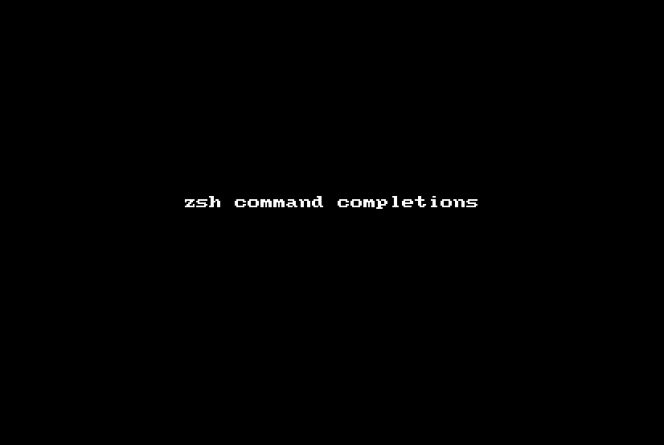

# ZSh Completions

`cli-tools` can automatically generate a zsh completions file for your tool.

The namespace `net.lewisship.cli-tools.completions` adds a `completions` command.  This command will
compose a zsh completion script, which can be installed to a directory on the $fpath such as
`/usr/local/share/zsh/site-functions`.

zsh completions greatly enhance the discoverability of commands, categories, and command options within a tool.
However, this functionality is considered _experimental_ due to the complexity of zsh completion scripts.

> Details forthcoming.
