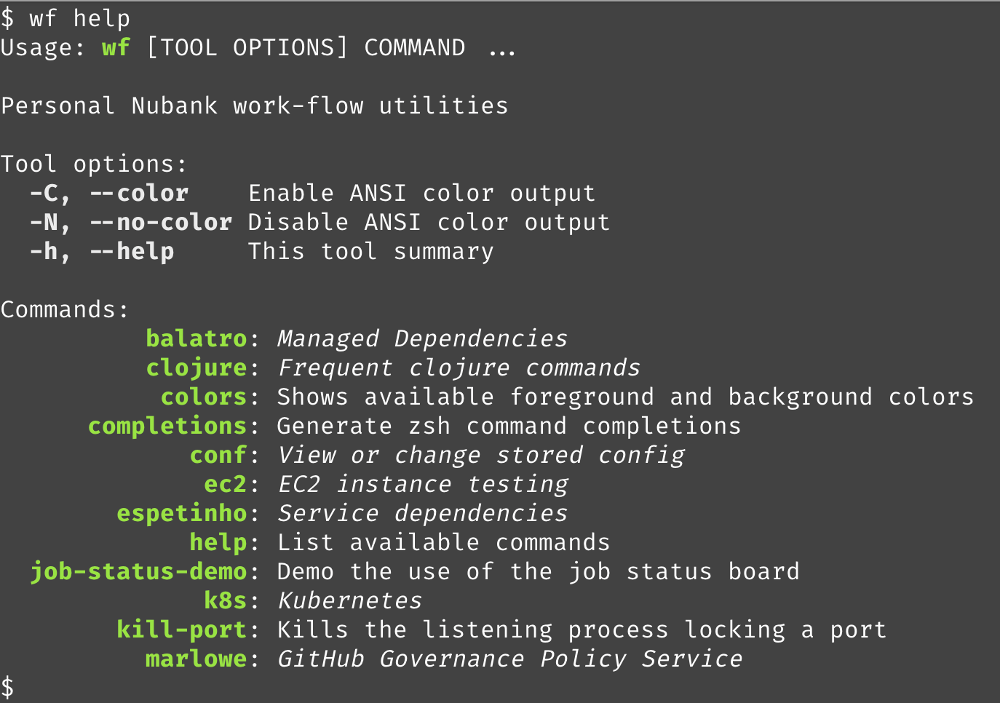

# Dispatch

The [[net.lewisship.cli-tools/dispatch]] function is the prime entrypoint for both Babashka and Clojure tools.

`dispatch` is provided with a descriptor map for your tool; it reads the namespaces defined in the descriptor to build
up an index of all the commands and command groups in your tool.

The `dispatch` function then starts to consume command line arguments, identifying groups and sub-groups until
it reaches leaf nodes, the commands; the command is passed the remaining command line arguments which it can parse
into options and positional arguments as defined by the [[net.lewisship.cli-tools/defcommand]] macro; these
are ultimately exposed as local symbols that your command's code can act on.

```clojure
{:namespaces [...]
 :doc "String that defines the tool, used in tool-level help."
 :groups {"my-group" {:title "One line title describing the group."
                      :doc "Longer description of the group, used in group-level help."
                      :namespaces [...]
                      :groups {...}]}]}
```

The top-level `:namespaces` is used to define any top-level ("Built-in") namespaces.
Each namespace is a symbol for the namespace.

This is optional and defaults to an empty list.

The namespace `net.lewiship.cli-tools.builtins` is always prefixed to the provided list; this provides
the tool-level `help` command.

The namespaces provide the top-level commands, but you may also specify _groups_.

Groups are containers of sub-commands, and may themselves contain sub-groups.

Groups serve two purposes:

* They divide the list of commands into sequences of related commands

* They may optionally define a command group name, which isolates the commands within the group; for example, the way the `docker` command has sub-commands such as `compose` and `volume`, each containing further sub-commands.

The group map is keyed on a command name, and its value defines the group; like the top-level map,
a group will contain keys for :namespaces, :title, :doc, and :groups (for more deeply nested groups).

The group's :title is used in the tool help summary.
               
                              

In the above example, `colors`, `completions`, `help`, `job-status-demo`, and `kill-port` are commands.
The remaining items are groups (shown in italics); the text shown is the :title for the group.

## Defaults
              
The :doc and :title group options may be omitted.

If :doc is omitted, then `dispatch` will search the provided namespaces, and use the first namespace docstring
it finds.

If :title is omitted, then the first line of the docstring, up to the first `.`, will be used as the title.


