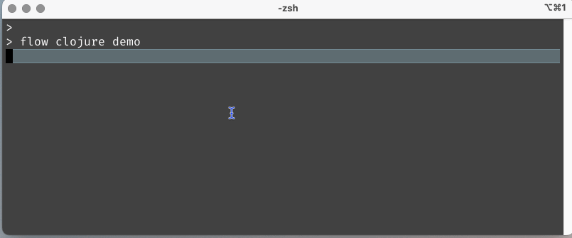

# Job Board (Experimental)

For tools that run for a while, visual feedback can be provided to the user using the _job board_
in the `net.lewisship.cli-tools.job-status` namespace.

Background processes (typically, running as individual threads, or core.async processes)
can provide feedback on status and progress through a simple API.
The job board updates status lines as they change, and highlights lines that have recently changed.

This is built on the `tput` command line tool, so it works on OS X and Linux, but **not on Windows**.

The above `job-status-demo`, like `colors`, can be added by including the `net.lewisship.cli-tools.job-status-demo` namespace.
