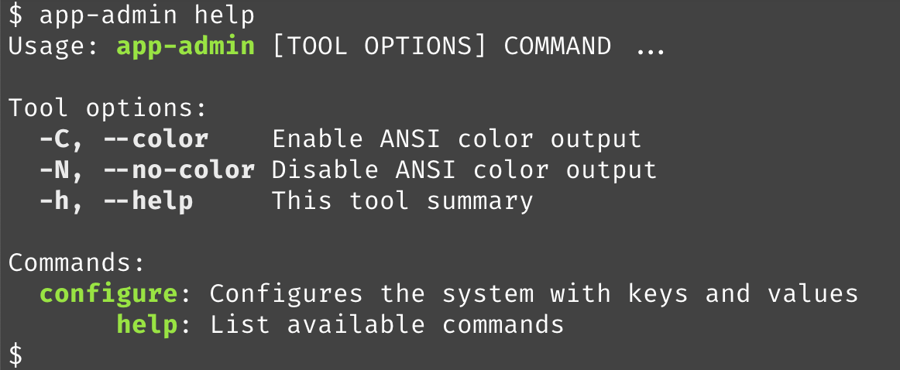
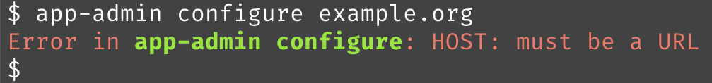
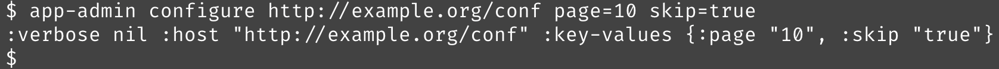
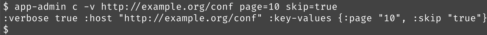

# Building a Script

So far, we can define commands in namespaces using [[defcommand]], and we know how we can use [[dispatch]] to roll
all of that into a single tools, but what actually calls `dispatch?`.  This is where we create the actual command-line script.


Following our prior example, we'll create a script named `app-admin`.  We'll put that in the `bin` directory of our project:

**bin/app-admin**:

```shell
#!/usr/bin/env bb

(require '[net.lewisship.cli-tools :as cli])

(cli/dispatch {:doc "Application Admin Tool"
               :namespaces '[app-admin.commands]})
```

The first line identifies, to the shell, that this command is implemented using Babashka.

`dispatch` will find all `defcommand`s in the given namespaces, parse the first command line argument, and use
it to find the correct command to delegate to.  That command will be passed the remaining command line arguments.
The default tool name will be the name of the script, `app-admin` in this example.

`dispatch` also recognizes `-h`, `--help`, or `help`, and will print out a summary of the available commands.

Finally, `dispatch` will allow an abbreviation of a command name to work, as a case-insentive prefix.

How does the `app-admin` script know where to find the code?  We add a `bb.edn` file to the `bin` directory.

**bin/bb.edn**

```clojure
{:paths ["../src" "../resources"]
 :deps {io.github.hlship/cli-tools {:mvn/version "<mvn version>"}}}      
```

Babashka looks for the `bb.edn` file in the same directory as the script, and uses it to set up the classpath.

The final step is to add that `bin` directory to the shell `$PATH` environment variable; this is done in your
`~/.zshrc` file, or equivalent.

Alternately, if you already have a location for commands, such as `~/bin`, you can create a symbolic link there
that points to your `bin/app-admin` script; Babashka will follow links and find the neighboring `bb.edn` file
at the final location of the script.  Handy!

With all that in place, we can now run `app-admin configure` through its paces:



> You may see a short delay the first time your script is executed as dependencies are resolved and downloaded;
> Subsequent executions are lightning fast.


Help is provided automatically and builds its content from the interface and the docstring
of each command function. 

Validations are reported with the tool name and command name:



The text above is written to standard error, and the command exit status is 1 (where 0 would mean success).

Unless there are errors, the body of the command is invoked:



The body here just prints out the values passed in.  That's not a bad starting point when creating new scripts.
I like to get all the command line parsing concerns out of the way before working on the _meat_ of the command.

Finally, `cli-tools` allows command names to be abbreviated, as long as the value on the command line is a unique prefix:




