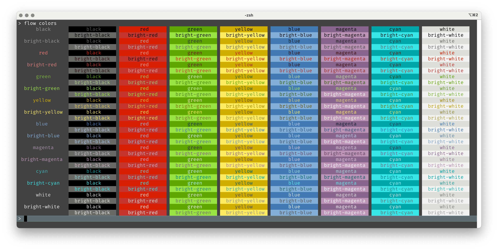

# Tips and Tricks

## Parsing Numbers

When an input is numeric, you can use Clojure's `parse-long` function to parse a number; it returns nil if
the string is not a number.  You can then check using `some?` within :validate:

```
(defcommand kill-port
  "Kills the listening process locking a port."
  [force ["-f" "--force" "Kill process without asking for confirmation"]
   :args
   port ["PORT" "Port number to kill"
         :parse-fn parse-long
         :validate [some? "Not a number"
                    pos? "Must be at least 1"]]]
  ...)                    
```

This handles invalid input gracefully:

```
> flow kill-port abc
Error in flow kill-port: PORT: Not a number
```

You might be tempted to use `#(Long/parseLong %)` as the parse function; this works, but the message produced comes from
the message of the thrown exception, and is not very friendly:

```
> flow kill-port abc
Error in flow kill-port: PORT: Error in PORT: For input string: "abc"
```

## Colors

You can add the namespace `net.lewisship.cli-tools.colors` to add a `colors` command.



This is a useful way to preview all the basic colors available.
